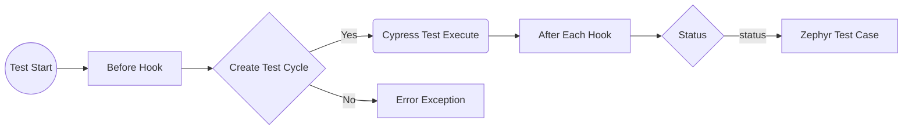

# Cypress & Zephyr Scale Integration 

# Problem Statement: 
I have a project in which the project team wanted to view the test execution of the Cypress test. We also utilise Zephyr as our test case management. I have been searching for ways to integrate these two, Zephyr & Cypress; however, I can't find a proper solution that fits my need

# Solution: 
I have developed a work-in-progress project to enhance Zephyr Scale integration with Cypress. My goal is to introduce a user-friendly update that adds a test cycle every time a cypress test is performed. This update will ensure that each associated test case is promptly updated with a status of either 'Passed,' 'Failed,' or 'Skipped'. With these improvements, it aims to streamline the testing process and provide clearer insights into the test results.

Will make futher ecnhancement when time permit.

## What it do?
- Create test cycle everytime cypress test executed by utilise Cypress hook ( *before()* & *eachAfter()* )
- Only update status of associated test cases

## What it not ?
- Does not update the test step
- Does not update beyond these initial setup status 'Passed,' 'Failed,' or 'Skipped'
- Does not update start and end time of each test

# Requirement:
- Valid Zephyr Scale API Access Token
- Valid Zephyr Test Case ID

# How it work:

A valid Zephyr Scale API access token required for the integration to work. The token can be obtain by clicking on your profile icon in Zephyr

Click on the **Create access token** button to generate the access token

Once the button click, a pop-ups will appear with the access token

Copy the token and place it inside cypress environment file. In this project, I refer it to *bearerToken* variable

For this integration to work, the test case reference require in each of the cypress test title. Following are example how can you write the title

    tag = 'PROJ-T1'
    it(`${tag} - User Details - Fields Validation`, () => {
        ...
    })

***or***

    it(`PROJ-T1 - User Details - Fields Validation`, () => {
      ...
    })

